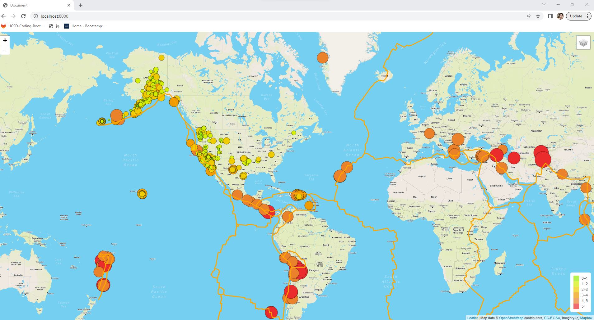
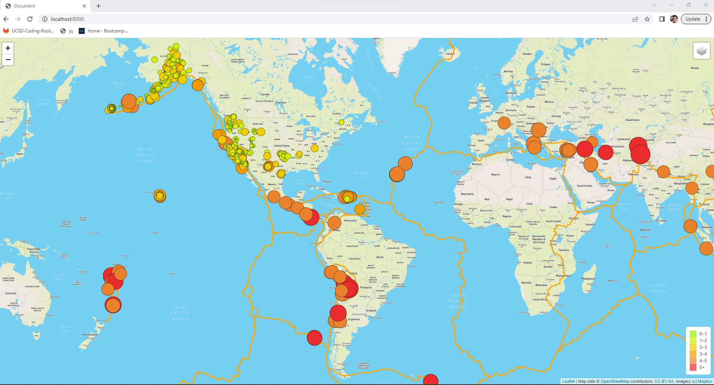
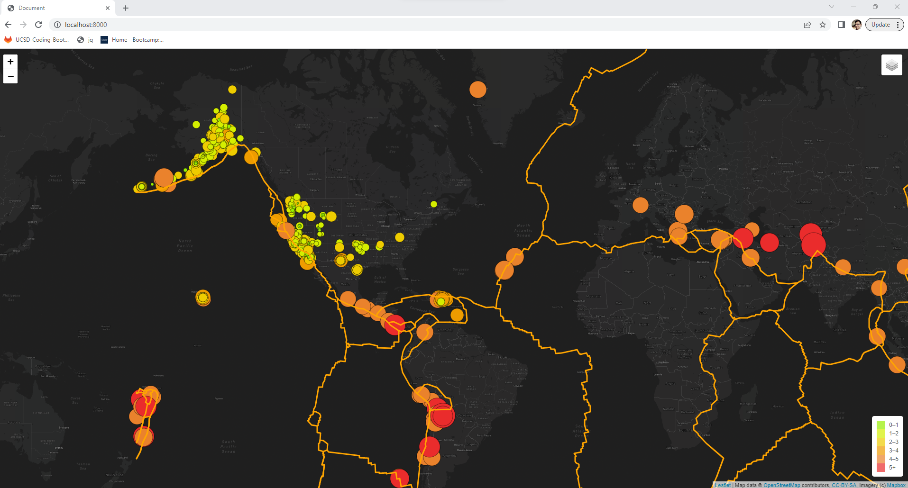

# Mapping_Earthquakes

This first picture shows the tectonic plate data we added into out map. 

This picture shows all the major earthquake data added into the map.

This map is the Dark mode feature added through styles.

